# siLOH - 🛢️🔎 SNP Inferred Loss of Heterozygosity Analysis Pipeline

siLOH is a Docker-based pipeline for analysing Loss of Heterozygosity (LOH) from NGS data. The pipeline integrates samtools, VarScan2, and a custom Python analysis script to identify potential regions of Loss of Heterozygosity (LOH).

The siLOH pipeline uses a targeted approach to identify candidate LOH regions by analysing the allele frequencies of predefined common SNPs (curated SNPs from dbSNP with Minor Allele Frequency (MAF) ≥ 30%) across the capture regions contained within an input BAM file.

## Pipeline Workflow

```mermaid
flowchart TD
    subgraph Input
        A[Input BAM File]
        B[MAF30 SNPs List]
        C[Reference Genome]
    end

    subgraph "Step 1: Variant Calling"
        D[Samtools mpileup]
        E[VarScan2 pileup2cns]
        F[Raw Variants at SNP Sites]
    end

    subgraph "Step 2: LOH Analysis"
        G[Analyze Variant Frequencies]
        H{Is Position Homozygous?<br/>≤35% or ≥65%}
        I[Build Region Streak]
        J{Region Criteria Met?}
        K[Split at Centromeres]
    end

    subgraph "Step 3: Filtering & Output"
        L{Final Region Filters}
        M[Gene Annotation]
        N[LOH Report]
    end

    %% Connections
    A & B & C --> D
    D --> E
    E --> F
    F --> G
    G --> H
    H -->|Yes| I
    H -->|No| G
    I --> J
    J -->|No| G
    J -->|"Yes<br/>≥5 homozygous sites<br/>≥1Mb size"| K
    K --> L
    L -->|"Pass:<br/>≥40 homozygous<br/>>90% confidence<br/>non-X chromosome"| M
    M --> N

    %% Styling
    classDef input fill:#e3f2fd,stroke:#1565c0
    classDef process fill:#f5f5f5,stroke:#424242
    classDef decision fill:#fff3e0,stroke:#ef6c00
    classDef output fill:#e8f5e9,stroke:#2e7d32

    class A,B,C input
    class D,E,F,G,I,K,M process
    class H,J,L decision
    class N output
```



## Pipeline Steps

1. **Pileup Generation**: Uses samtools mpileup to generate pileup data at specified positions
2. **Variant Calling**: VarScan2 analyzes the pileup to identify variants
3. **LOH Analysis**: Custom Python script processes variants to identify LOH regions
4. **Output Generation**: Results are saved in CSV format

## Prerequisites

- Docker installed and running
- Input BAM files
- Reference genome (ucsc_hg19.fa)
- BED file containing regions of interest
- Sufficient disk space for analysis

## Installation

1. Clone the repository:
```bash
git clone https://github.com/g-pyxl/siLOH.git
cd siLOH
```

2. Build the Docker image:
```bash
docker build -t siloh .
```

## Required Files

The pipeline expects the following files:

- **Reference Genome**: `ref/ucsc_hg19.fa` (GRCh37 example)
- **Sample BAM Files**: Contig naming should follow "chr1" format
- **BED File**: `beds/R210.bed` - The pipeline comes provided with an R210.bed designed for Lynch Syndrome calling. Tool can be ran with or without BED file calling.
- **maf30.txt**: Over 1.8m SNPs with high MAF, curated from dbSNP
- **centromeres.json**: Centromere positions relative to GRCh37 (provided in repo)

## Directory Structure

```
siLOH/
├── Dockerfile
├── requirements.txt
├── run_analysis.sh
├── loh.py
├── maf30.txt
├── centromeres.json
├── ref/
│   └── ucsc_hg19.fa
├── samples/
│   └── your_sample.bam
├── results/
└── beds/
    └── R210.bed
```

## Usage

1. Run the analysis:
```bash
docker run -v /path/to/ref:/app/ref \
           -v /path/to/samples:/app/samples \
           -v /path/to/results:/app/results \
           -v /path/to/beds:/app/beds \
           siloh your_sample_name
```

Replace `/path/to/` with your actual paths and `your_sample_name` with your BAM filename (without the .bam extension).

## Output

The pipeline generates the following files in the results directory:
- `{sample}.pileup`: Raw pileup data
- `{sample}.cns`: VarScan2 consensus output
- `{sample}.loh.csv`: Final LOH analysis results

The LOH CSV file contains:
- Chromosome
- Start position
- End position
- Affected genes (if BED file provided)

## Debugging

To enter the container without running the analysis:
```bash
docker run -it --entrypoint=/bin/bash siloh
```

## Resource Requirements

- Memory: Depends on input BAM file size
- Disk Space: ~3x the size of input BAM file
- CPU: Single-threaded processing

## Known Limitations

- Currently supports hg19 reference genome
- Single-sample processing
- Requires sorted, indexed BAM files - .bai should be within same directory as BAM

## Citation


## License


## Contact


## Contributing


